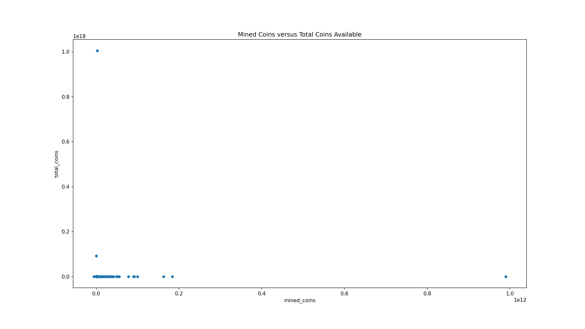
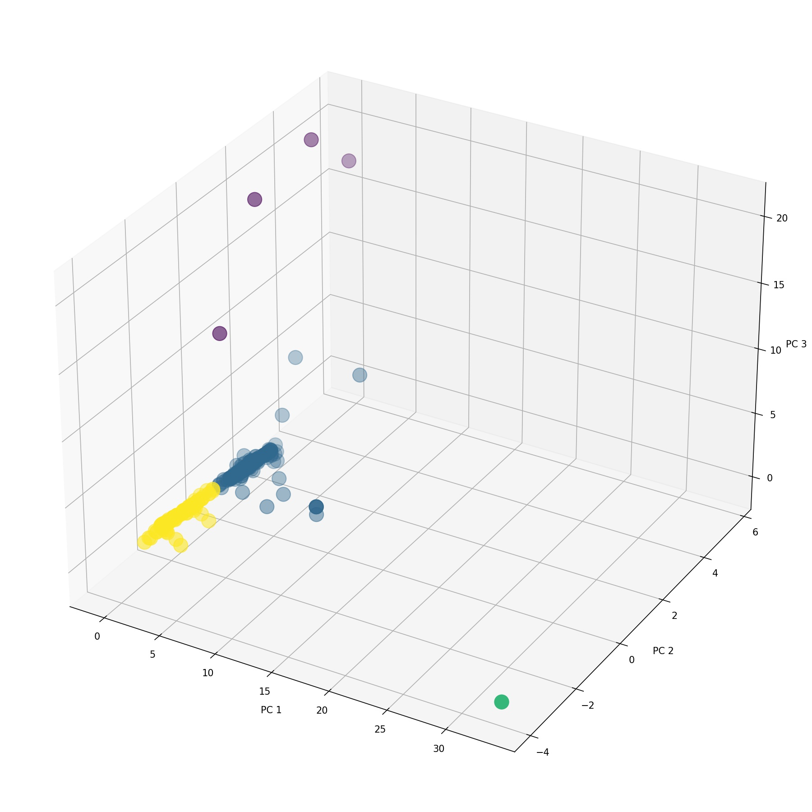

# ml-clustering-crypto

Author:  Erin James Wills - ejw.data@gmail.com  

  
<cite>Photo by [Kanchanara](https://unsplash.com/@kanchanara?utm_source=unsplash&utm_medium=referral&utm_content=creditCopyText) on [Unsplash](https://unsplash.com/s/photos/crypto?utm_source=unsplash&utm_medium=referral&utm_content=creditCopyText)</cite>

 

## Overview  

  

Compares several machine learning clustering models to determine whether the currencies can be logically classified based on the given data.  Data is prepared by removing null values, converting the datatypes, and applying two one-hot-encoding techniques.  The number of features were reduced to only three by using PCA.  The initial clustering technique seleected was KMEAN and the k was selected by inspecting the inertia elbow diagram.  The results indicated that there were four clusters with two clusters representing crypto currencies that had 0% of their coins mined and 100% of their coins mined.  The two other clusters represent currencies that had only been partially mined with one cluster representing largely PoW type coins and the other cluster representing PoS and hybrid coin types.  
   
   

## Technologies    
*  Python
*  Scikit-Learn

 

## Data Source  
Unknown

 

## Setup and Installation  
1. Environment needs the following:  
    *  Python 3.6+  
    *  numpy  
    *  pandas  
    *  scikit-learn
1. Clone the repo to your local machine
1. Activate your environment in that directory  
1. Open a Jupyter Notebook   
1. Run `clustering_crypto_types.ipynb` or `clustering_crypto_prices.ipynb`  

 

## Analysis  

Four clusters were generated with two clusters having very few instances and two clusters containing over 98% of the data.  Each cluster does have distinct characteristics.  

**Low Count Clusters**
* Looks like Group 0 is crypto that has not been mined but has large total coins - Maybe call this the New Currencies
* Looks like Cluster 2 is of one cryto currency that is highly mined and nearly depleted - maybe call this the Matured or Depleted Currencies  

**High Count Clusters**
* Cass 1 and Class 3 indicate that these are established cryto currencies.
* Proof_type and algorithm seem to be independent in the above analysis but need to check to see if there is a relationship within each cluster related to these features.   

**Variable Interactions**  

* The results show that there are only 10 algorithms with a variety of proof types and more than 5 records.  
* There are 696 records and 503 of these represent different proof types, but almost half of these records are represented by Scrypt algorithm.  
*  The proof_type might need to be better classified or generalized.  
* Since so many records don't have a clear relationship between algorithms and proof_type, the two variables will be assumed to be independent.  

**Other**  
* mined_coins and total_coins have the most influence.
* is_trading is not represented differently in the two clusters
* Each algorithm shows a couple proof_type.
* This is also reflected with multiple algorithm variables in Cluster 1 and Cluster 3.
* Very few proof_type variables are in both Cluster 1 and Cluster 3 - it looks like POW are in Cluster 3 and POS and hybrid types are in Cluster 1  

**Plot of Two Most Significant Features  

 

**Plot of PCA and Cluster Analyses  

